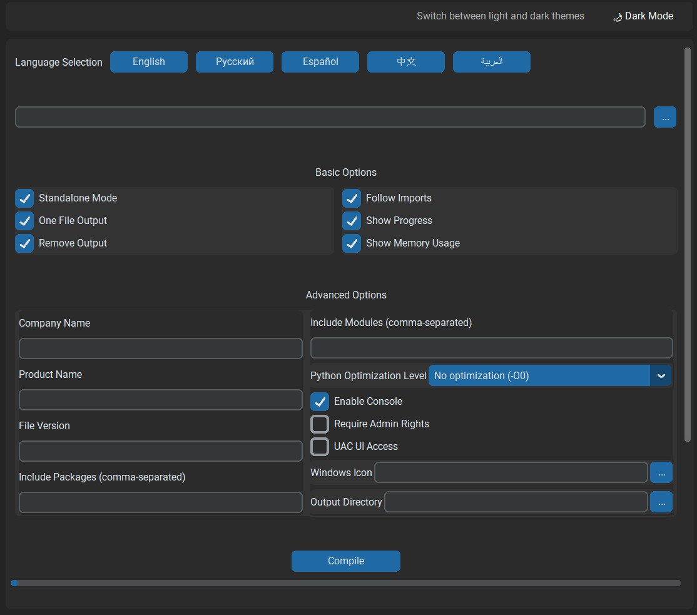

# Nuitka Compiler GUI
  


A graphical interface for the Nuitka Python compiler that simplifies the process of compiling Python applications into standalone executables.



## Features

- Standalone executable generation
- Single-file output option
- Multi-language interface (English, Russian, Spanish)
- Windows-specific settings (UAC, admin rights)
- Custom icon integration
- Company and product metadata
- Package/module inclusion options
- Real-time compilation progress
- Custom output directory

## Installation

1. Clone the repository:
   ```bash
   git clone https://github.com/HOCKN28/Nuitka-compiler-GUI.git
   cd Nuitka-compiler-GUI
   ```

2. Install dependencies:
   ```bash
   pip install -r requirements.txt
   ```

## Usage

1. Launch the application:
   ```bash
   python main.py
   ```

